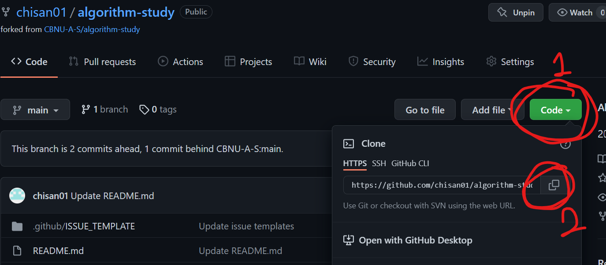

# A/S 알고리즘 스터디

2022 1학기 동안 진행

## 스터디 진행 방식

<details><summary>자세히</summary>

* ### 개념 스터디

  * 스터디 당일 (토요일 9시)
  * 주차별로 돌아가면서 원하는 개념 발표 + 관련 문제 2개 정해오기
  * 진행방식
    1. 개념 발표
    2. 해당 개념에 대해서 질의응답 등 자유롭게 토의
    3. 관련 문제 다같이 풀어보고 풀이 공유

* ### 과제 (2문제)

  * 진행방식
    1. **공동 2문제 풀어보기 + 코드 리뷰**
       * 토요일까지 문제 골라서 [issue](https://github.com/CBNU-A-S/algorithm-study/issues)랑 [README 표](https://github.com/CBNU-A-S/algorithm-study/main/README.md#%EB%AC%B8%EC%A0%9C%EC%A7%91)에 추가
       * [과제 제출 방식](https://github.com/CBNU-A-S/algorithm-study/main/README.md#%EA%B3%BC%EC%A0%9C-%EC%A0%9C%EC%B6%9C-%EB%B0%A9%EC%8B%9D) 참고
    2. 자유롭게 2문제씩 풀어오기 + 인당 한문제씩 코드리뷰

</details><br>

## GitHub에 코드 올리는 방법

<details><summary>자세히</summary>


### 0. 초기 환경 설정

1. #### 맨 처음, 이 repository를 `fork` 한다.

   <p align="center">
    
   </p>

2. #### `fork` 받은 저장소를 자신의 컴퓨터에 clone 받은 뒤 자신의 이름으로 된 폴더를 생성한다.

   앞으로 올리는 모든 파일들은 `자신의 이름`으로 된 폴더 안에 올려야 한다

   <p align="center">
    
   </p>

   ```bash
   $ git clone [fork한 자신의 repository 주소]
   $ cd alorithm-study
   $ mkdir [자신의 이름]
   ```

   **주의**: IDE로 폴더를 열때 `자신의이름` 폴더를 열어야 `.ide` 같은 에디터 설정 파일들이 엉뚱한데 추가되지 않는다

3. #### upstream 주소 추가

   ```bash
   $ git remote add upstream https://github.com/CBNU-A-S/algorithm-study.git
   $ git remote -v
   ```
<br>

### 1. 저장소 최신으로 업데이트

커밋 내역을 깔끔하게 하기 위해서 `-r` 옵션 사용

```bash
$ git pull -r upstream main
```

<br>

### 2. 문제별로 커밋 생성

* 문제별 고민 시간은 최대 1시간을 넘기지 않는 것이 좋다.

* 코드 리뷰를 진행하므로 최대한 가독성이 좋게 작성하려고 노력해보기

* 커밋하는 방법

  ```bash
  $ git add .
  $ git status
  $ git commit -m "#10 - [프로그래머스] 문자열 압축 / 30분"
  $ git push origin main
  ```

* #### 커밋 메시지 생성 규칙

  `#문제집issue번호 - [문제출처] 문제이름 / 소요시간 (풀지못한 경우 실패)`

  ex) #10 - [프로그래머스] 문자열 압축 / 30분

  > 커밋 메시지에 issue 번호를 포함시키면, 추후에 issue에 해당 커밋들을 모아서 확인할 수 있다.

* #### 문제집 `issue` 번호

  GitHub `issue` 탭에서 확인할 수 있다.

  * 주차별 과제
  * 개념스터디때 풀어본 문제


<br>

### 3. 해당 문제집의 문제들을 다 풀고나면 PR 생성

`fork` 해 온 저장소로 이동해서 Pull Request를 생성한다.

* #### 제목

  `문제집 이슈번호`와 `작성자`를 포함시켜서 작성

  ex) `#10 알고리즘 문제풀이 - chisan01`

* #### 내용

  풀이 간단하게 설명, 문제풀면서 어려웠던 점, 소요시간 등 적어두기

- 주차별 과제의 경우 reviewer 모두 지정하기

<br>

### 4. 코드리뷰 후 merge

* 코드 리뷰 내용은 자유롭게 작성하기
  - 코드에 대해서 궁금한 점 질문
  - 코드에 대한 칭찬
  - 코드 개선 아이디어 건의 (성능, 클린코드 등)
  - 등등 ..
* 코드 리뷰가 끝난 뒤 필요에 따라 추가로 리팩토링하고 커밋 (커밋 형식은 자유)

</details><br>

## 문제집

<!-- <details><summary><strong>주차별 과제</strong></summary><br> -->
* ### 주차별 과제

  | 주차 \ 출제자 | 안치산 | 이진영 | 최문형 | 풍혜림 |
  | ------------- | ------------------------------------------------------------ | ------------------------------------------------------------ | ------ | ------ |
  | 1주차 |  |  |  |  |
  | 2주차 | [프로그래머스] Lv.2 [큰 수 만들기](https://programmers.co.kr/learn/courses/30/lessons/42883) | [프로그래머스] Lv.2 [더 맵게](https://programmers.co.kr/learn/courses/30/lessons/42626) |  |  |
  | 3주차 |  |  | [백준] 실버3 [Flying Safely](https://www.acmicpc.net/problem/9372) | [백준] 실버4 [미로 만들기](https://www.acmicpc.net/problem/1347) |
  | 4주차 | [프로그래머스] Lv.2 [스킬트리](https://programmers.co.kr/learn/courses/30/lessons/49993) | [프로그래머스] Lv.2 [구명보트](https://programmers.co.kr/learn/courses/30/lessons/42885) |  |  |
  | 5주차 | [프로그래머스] Lv.3 [정수 삼각형](https://programmers.co.kr/learn/courses/30/lessons/43105) | [백준] Silver3 [크리스마스 선물](https://www.acmicpc.net/problem/14235) |  |  |
  | 6주차 |  |  | [백준] Gold5 [돌 게임 6](https://www.acmicpc.net/problem/9660) | [백준] Silver1 [시간 관리](https://www.acmicpc.net/problem/1263) |
  | 9주차 | [백준] Gold 5 [호텔](https://www.acmicpc.net/problem/1106) | [백준] Silver 3 [스위치 켜고 끄기](https://www.acmicpc.net/problem/1244) |  |  |
  | 10주차 | [백준] Silver 3 [01타일](https://www.acmicpc.net/problem/1904) |  | [백준] Gold 5 [사다리 타기](https://www.acmicpc.net/problem/2469) |  |
  | 11 |  |  |  |  |
  |  |  |  |  |  |
  |  |  |  |  |  |
  |  |  |  |  |  |

<!-- </details> -->

<!-- <details><summary><strong>주차별 개념 + 관련 문제</strong></summary><br> -->
* ### 주차별 개념 + 관련 문제

  |       | 발표할 개념     | 발표자 | 문제 1                                                       | 문제 2                                                    |
  | ----- | --------------- | ------ | ------------------------------------------------------------ | --------------------------------------------------------- |
  | 1주차 | Greedy 알고리즘 | 최문형 | [백준] 실버4 [문서 검색](https://www.acmicpc.net/problem/1543) | [백준] 골드5 [센서](https://www.acmicpc.net/problem/2212) |
  | 2주차 | Brute Force 알고리즘 | 이진영 | [백준] 실버2 [Lotto](https://www.acmicpc.net/problem/6603) | [백준] 골드1 [구슬 탈출 2](https://www.acmicpc.net/problem/13460) |
  | 3주차 | Bubble Sort 알고리즘 | 풍혜림 | [백준] 브론즈1 [알고리즘 수업 - 버블 정렬 1](https://www.acmicpc.net/problem/23968) | [백준] 플래티넘4 [알고리즘 수업 - 버블 정렬 5](https://www.acmicpc.net/problem/24047) |
  | 4주차 | DP(Dynamic Programming) 알고리즘 | 안치산 | [프로그래머스] Lv.3 [N으로 표현](https://programmers.co.kr/learn/courses/30/lessons/42895) | [백준] Bronze3 [피보나치 수](https://www.acmicpc.net/problem/2747) |
  | 5주차 | 최단거리 알고리즘 | 최문형 | [백준] Gold4 [타임머신](https://www.acmicpc.net/problem/11657) | [백준] Silver3 [등수 매기기](https://www.acmicpc.net/problem/2012) |
  | 9주차 | Greedy & Brute Force 복습 | | [백준] Silver4 [게임을 만든 동준이](https://www.acmicpc.net/problem/2847) | [백준] Silver3 [퇴사](https://www.acmicpc.net/problem/14501) |
  | 10주차 | DFS & BFS | 이진영 | [백준] Silver3 [바이러스](https://www.acmicpc.net/problem/2606) | [백준] Silver2 [바이러스](https://www.acmicpc.net/problem/1012) |
  | 11주차 |  |  |  |  |
  |  |  |  |  |  |
  |  |  |  |  |  |
  |  |  |  |  |  |

<!-- </details><br> -->
